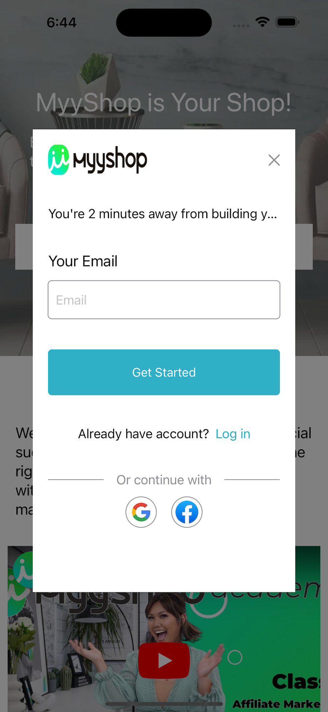

i# MyyShop iOS App

The MyyShop iOS App is a simplified demo showcasing my implementation approach for developing an iOS app for MyyShop (https://www.myyshop.com). This project is primarily implemented using SwiftUI, with navigation handled using UIKit.

## About MyyShop

MyyShop is a cutting-edge online marketplace that offers a wide range of products to customers worldwide. With an extensive catalog spanning various categories, including electronics, fashion, home decor, and more, MyyShop aims to provide a seamless shopping experience to its users.

## Features

### User-Friendly Interface
The MyyShop iOS App offers an intuitive and user-friendly interface, ensuring that customers can easily browse and discover products of interest. The app follows modern design principles and provides a visually appealing layout to enhance the shopping experience.

### Seamless Product Search
Customers can quickly find their desired products using the powerful search functionality integrated into the MyyShop iOS App. The search feature offers smart suggestions and filters, making it effortless to explore and locate specific items.

### Personalized Recommendations
MyyShop utilizes advanced algorithms to offer personalized product recommendations to users. By analyzing their browsing and purchase history, the app tailors recommendations to match individual preferences, ensuring a curated shopping experience.

### Secure and Convenient Checkout
The MyyShop iOS App prioritizes security and convenience during the checkout process. Users can securely complete their purchases with various payment options, including credit cards, digital wallets, and more, providing a seamless and hassle-free transaction process.

### Order Tracking and Notifications
Customers can stay updated on the status of their orders through the MyyShop iOS App. Real-time order tracking and notifications keep users informed about the progress of their purchases, ensuring a transparent and reliable shopping experience.

## Design Pattern

The MyyShop iOS App follows the Model-View-ViewModel (MVVM) design pattern, which I consider the most suitable approach. While some might argue that this pattern might be slightly excessive for a small application, I found it to be highly beneficial, significantly reducing development time, and seamlessly integrating with SwiftUI.

## Dependencies

This application prioritizes simplicity and does not rely on any third-party libraries or frameworks. All functionality has been implemented natively in Swift/SwiftUI. However, to handle authentication, there is some code that relying on the following libraries:
- Firebase
- FirebaseAuth
- GoogleSignIn
- GoogleSignInSwift

All of these dependencies were added using SPM.

## Screenshots

    
    
    
    
    

**Note:** This application is a simplified demo of the MyyShop iOS app and is not intended for production use. It serves as a demonstration of my implementation approach and should not be used in a live production environment.
